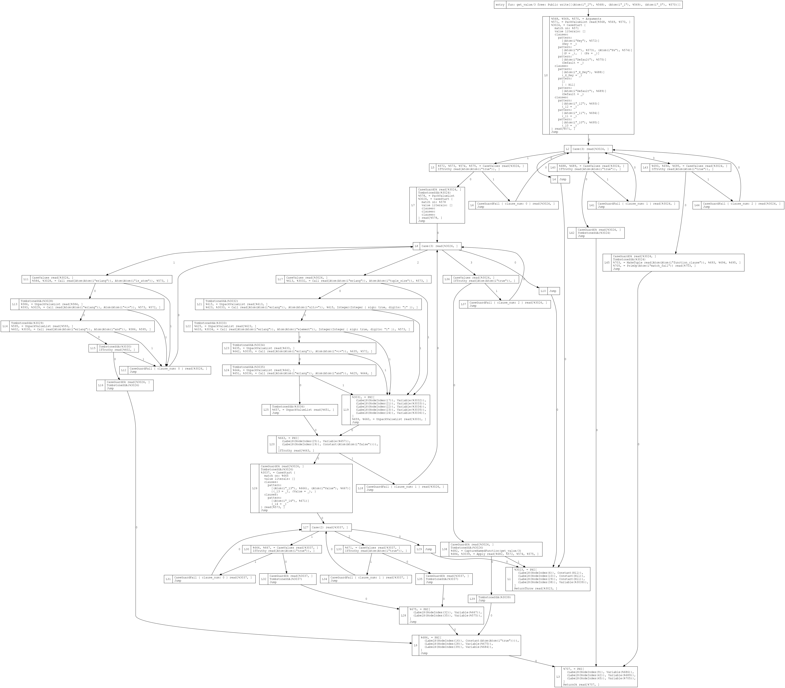

# core_erlang
Core Erlang compiler implemented in Rust

Currently compiles a Core Erlang to a (relatively) low level IR.

Current area of work: **Making LIR interpreter successfully run compile:file/1**

Current features:
* Parses .core file to parse tree
* Converts parse tree into hierarchical HIR (High-level IR)
* Resolves scoping, converts to SSA form
* Performs lambda lifting on closures
* Flattens HIR into flat LIR (Low-level IR)
* Performs basic constant propagation
* Produces DOT graph from LIR
* Executes (parts of, for now) LIR in reference interpreter
